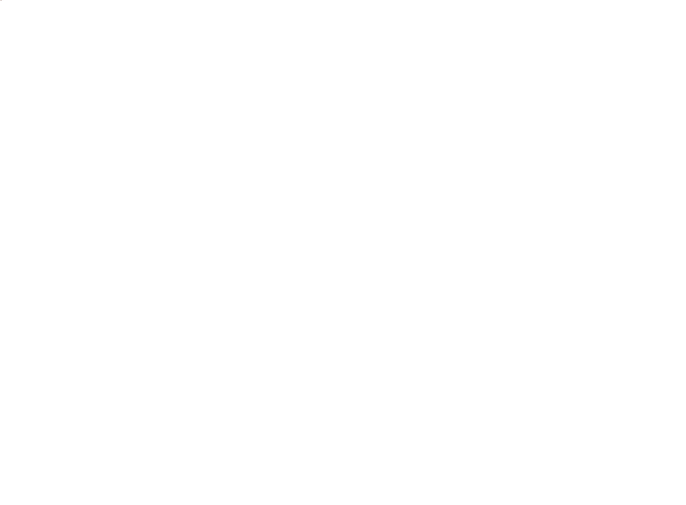
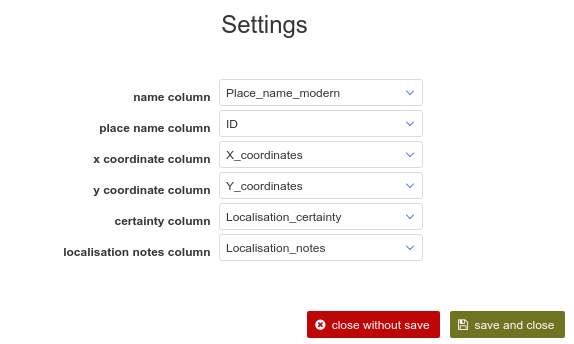

# MANUAL

## 1 Description

Historical Geocoding Assistant is a tool for assisted geocoding of historical datasets (an alternative to batch and manual geocoding strategies).

## 2 Table input

The HGA application works with tables stored in google drive in a spreadsheet form. A working example of such table is located [here](https://docs.google.com/spreadsheets/d/1FaW23x-ZT3pmdmv77eKPJxsfGhoB1urwfvPffN_4keU).

### 2.1 Localisation columns

Each table should consist of some arbitrary columns (column names are advised but not necessary to follow, see **6.5**. At the beginning of the geocoding process, only the **Location name** column is filled.

#### 2.1.1 location name

Location name of the record - this value is used for all search engines (see **6.3** and **6.4**).

#### 2.1.3 x coordinate

Longitude coordinate.

#### 2.1.4 y coordinate

Lattitude coordinate.

#### 2.1.5 certainty level

Level of assigned location certainty:

- 1 - coordinates are precise (at the level of granularity chosen for the given dataset)
- 2 - coordinates are approximate (e.g., a centroid of a region was used, the coordinates of a known settlement nearby were used instead of those of a place which could not be localized, etc.)
- 3 - coordinates are uncertain or ambiguous (mostly in cases where there are more candidate places and the editor chooses the most probable one)
- 4 - localisation was not successful

#### 2.1.6 localisation note

Optional note concerning the own localisation process

## 3 Table Prompt

Table prompt window asks for your table id, see **2**

## 4 Application layout

The own application layout consists of:

- map
- right panel
- map control panel

## 5 Map

Most of the screen space is covered by the own map. In the top-left corner, there are small map buttons:

- zoom buttons
- measure tool - allows measuring distances

It is possible to interact with map (zooming, panning) and indirectly manipulate with the layers(see [7](#7-map-control)). Map shows up four types of colored pins - current location, all other locations, geonames suggestions and wikipedia suggestions (see **6.5**).
When the map is clicked, the location of current record is moved into this coordinates and the column values are reassigned.

## 6 Panel

Panel covers the right-most part of screen and is used to select and edit record data and assign global settings. Panel consists of various sections.

### 6.1 Selection

Record selection menu is located under the application logo. Subsections:

- number of all records and position of the selected one
- select to choose record to edit and arrows to move to the next (previous) record
- restore (cancel all edits) and save (store edits to the table) buttons

## 6.2 Data

Section to handle and edit values of the record. There are two subsections:

- localisation - to handle "localisation columns" described in **2.1**, underneath are 4 buttons:

- highlight - highlight actual position on map(without panning)
- focus - pan and zoom to the position of the record
- revert - use original values
- remove - remove actual coordinates

- record data - all columns taken from the input table

## 6.3 Geocoding suggestions

Suggestions are made based on the value of column "name" (see **2.1.1**). At this moment, two geocoding services are implemented:

- [geonames](http://www.geonames.org/)
- [wikipedia](wikipedia.org)

Each suggestion has a button to focus the location and to save the suggested coordinates. Wikipedia suggestions have a button to open a new tab with the original wikipedia post.

## 6.4 Auxiliary search engines

In case the suggestions did not provide a correct answer, the user can try auxiliary search engine:

- google search
- google maps search
- [peripleo](http://peripleo.pelagios.org/) search engine

Clicking the auxiliary search icon will open a new tab of browser with the url of the value of column "name" ("location name" in case of google search)

## 6.5 Settings

Setting section is used to set additional options and rules, how the hga works.

- display all records on map - will show all previously geocoded places in map (black pins)
- clusters - will display pins in a form of clusters (instead of a mesh of accumulated pins)
- focus map on record change - should the map be refocussed, when a new record is selected
- zoom level - ...at what zoom level?
- columns - opens up a menu with the possibility to reassign column names for Localisation columns (see **2.1**)
- geo extent - opens up a menu to set a geographical bounding box for geocoding (see **6.3**)

## 7 Map control

Map control menu is located in the bottom-left part of the map and has two subsections:

- base layers - two overlayed base maps and the opacity of the top one
- oberlay layers - auxiliary overlay layers (in various formats - geojson, wms, ...), their order and opacity

## 8 config files

When deploying your own version of HGA, you can use config files (json formatted) to customise the content and rules of the application. There are 4 config files:

- config.json - various customisation like colors, default options...
- config_api.json - google api id and key (note that this file has to be created, it is not in repository!)
- basemaps.json - a list of base layers (wms or tile service)
- mapoverlays.json - other auxiliary layers in a format of geojson or wms (modern countries...)
