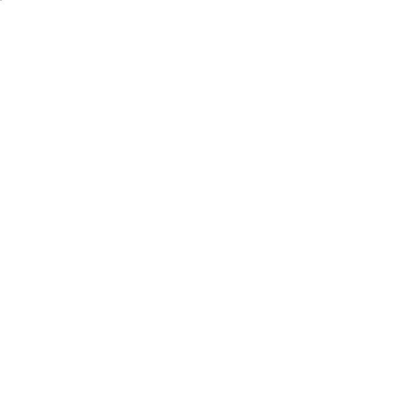
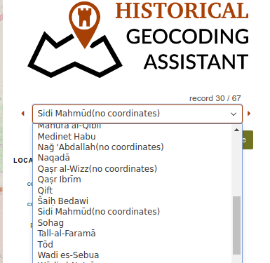
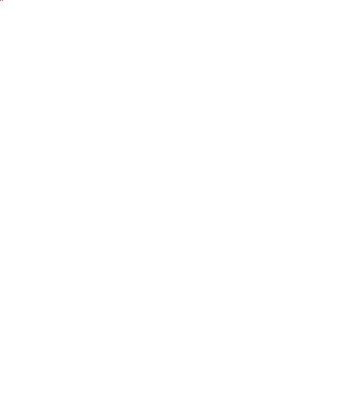

# MANUAL

## 1 Description

Historical Geocoding Assistant is a tool for assisted geocoding of historical datasets (something between a manual table editing and automated geocoding script)

## 2 Table input

The HGA application works with tables stored in google drive as a spreadsheet. An working example of such table is located [here](https://docs.google.com/spreadsheets/d/1FaW23x-ZT3pmdmv77eKPJxsfGhoB1urwfvPffN_4keU).

### 2.1 Localisation columns

Table should consist of some localisation columns (names of columns are advised but not neccesary to follow, see **11**:

#### 2.1.1 location name

location name for the record. This value is used for all search engines (see **6.3** and **6.4**)

#### 2.1.3 x coordinate

longitude coordinate

#### 2.1.4 y coordinate

lattitude coordinate

#### 2.1.5 certainty level

level of location certainty:

* 1 - coordinates are precise (at the level of given granularity)
* 2 - localisation is not precise (eg, centroid of region was used...)
* 3 - coordinates are possible but not certain
* 4 - localisation is not possible (or unwanted)

#### 2.1.6 localisation note

optional note concerning the own localisation process

## 3 Table Prompt

Table prompt window asks for your table id, see **2**

## 4 Application layout

The own application layout consists of:

* map
* right panel
* map control panel

## 5 Map

Most of the screen space is covered by the own map. In the top-left corner, there are small map buttons:

* zoom buttons
* measure tool - allows measuring distances

It is possible to interact with map (zooming, panning) and indirectly manipulate with the layers(see [7](#7-map-control)). Map shows up four types of colored pins - current location, all other locations, geonames suggestions and wikipedia suggestions (see [6.5](#6.5-geocoding-suggestions)).
When the map is clicked, the location of current record is moved into this coordinates and the column values are reassigned.

## 6 Panel

Panel covers the right-most part of screen and is used to select and edit record data and assign global settings. Panel constists of more sections.

### 6.1 Selection

Record selection menu is located under the application logo. Subsections:

* number of all records and position of the selected one
* select to choose record to edit and arrows to move to the next (previous) record
* restore (cancel all edits) and save (store edits to the table) buttons

## 6.2 Data

Section to handle and edit values of the record. There are two subsections:

* localisation - to handle "localisation columns" described in **2.1**, underneath are 4 buttons:

  * highlight - highlight actual position on map(without panning)
  * focus - pan and zoom to the position of the record
  * revert - use original values
  * remove - remove actual coordinates

* record data - all columns taken from the input table

## 6.3 Geocoding suggestions

At this moment, two geocoding services are implemented:

* [geonames](http://www.geonames.org/) - suggestions made based on the value of column "location name" (see **2.1.2**)
* [wikipedia](wikipedia.org) - suggestions made based on the value of column "name" (see **2.1.1**)

Each suggestion has a button to focus the location and to save the suggested coordinates. Wikipedia suggestions have a button to open a new tab with the original wikipedia post.

## 6.4 Auxiliary search engines

In case the suggestions did not provide a correct answer, the user can try auxiliary search engine:

* google search
* google maps search
* [peripleo](http://peripleo.pelagios.org/) search engine

Clicking the auxiliary search icon will open a new tab of browser with the url of the value of column "name" ("location name" in case of google search)

## 6.5 Settings

## 7 Map control

## 8 config file
