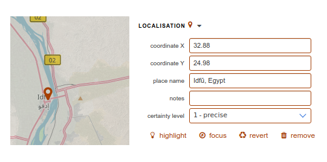

# MANUAL

## Description

Historical Geocoding Assistant is a tool for assisted geocoding of historical datasets (something between a manual table editing and automated geocoding script)

## Table input

The HGA application works with tables stored in google drive as a spreadsheet. An working example of such table is located [here](https://docs.google.com/spreadsheets/d/1FaW23x-ZT3pmdmv77eKPJxsfGhoB1urwfvPffN_4keU).

### Functional columns

Table should consist of some functional columns (names of columns are advised but not neccesary to follow):

#### name

id or unique key that represents the record

#### location name

name of the location (could be the same column as "name"); for better search results it is recommened to specify the location name as much as possible (eg, adding a modern country name - Abou Ouda, Egypt).

#### x coordinate

longitude coordinate

#### y coordinate

lattitude coordinate

#### certainty level

level of location certainty:

* 1 - coordinates are precise (at the level of given granularity)
* 2 - localisation is not precise (eg, centroid of region was used...)
* 3 - coordinates are possible but not certain
* 4 - localisation is not possible (or unwanted)

#### localisation note

optional note concerning the own localisation process

## Table Prompt

## Application layout

## Record Selection

## Functional columns

## "Localisation" section

## "Record data" section

## Geocoding suggestions (geonames, wikipedia)

## Auxiliary search engines

## "Settings" sections

## "Map control" panel

## config file
